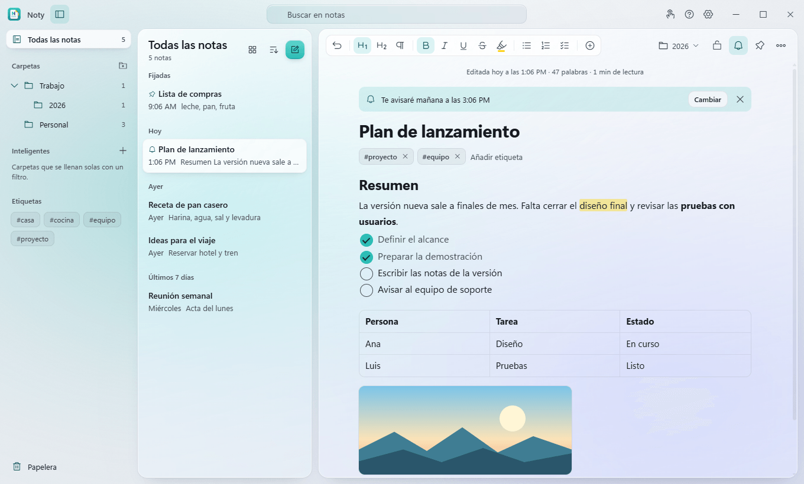
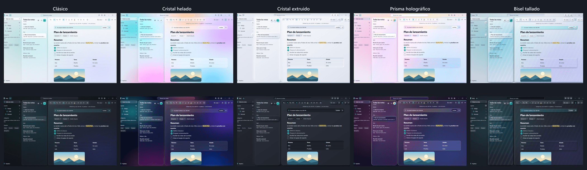
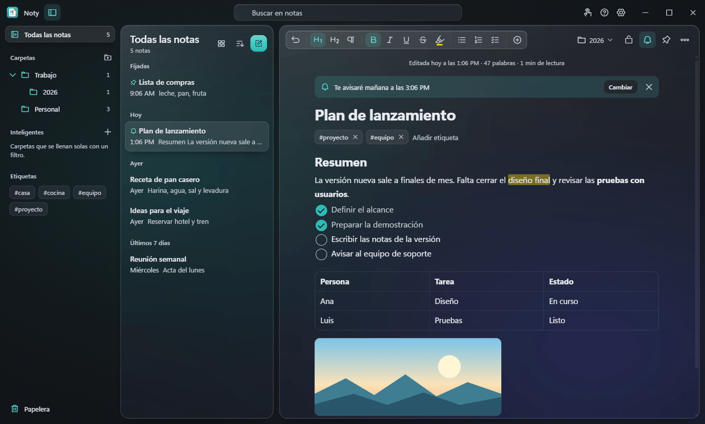
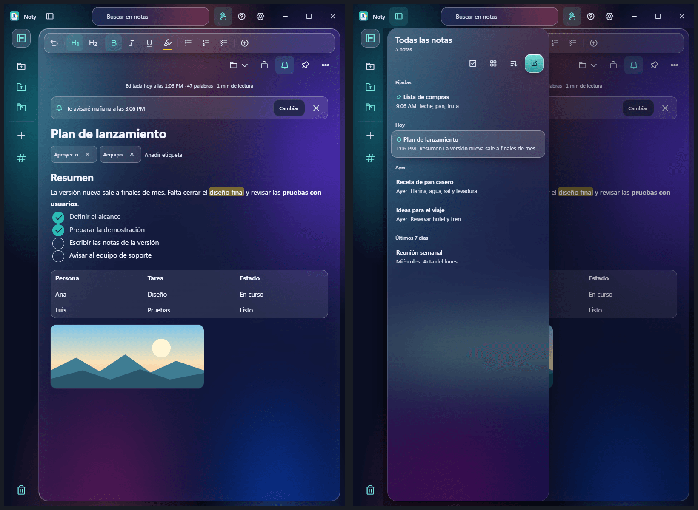

[**⬇ Descargar Noty para Windows**](https://github.com/jpinchi/noty-releases/releases/latest/download/Noty-Setup.exe) · [Todas las versiones](https://github.com/jpinchi/noty-releases/releases)

  

Noty es una app de notas de escritorio con un diseño de cristal translúcido, hecha para escribir rápido y encontrar después lo que apuntaste.
No necesita cuenta, no usa servidores y funciona sin conexión: tus notas viven en tu computadora.

## Lo que puedes hacer

- **Apuntar desde cualquier programa.** Pulsa **Ctrl + Shift + Espacio** y escribe en una ventanita flotante; la nota queda guardada sin abrir Noty.
- **Dar formato sin complicarte:** títulos, negrita, listas, **tareas con casillas**, tablas, imágenes, bloques de código, resaltador de cinco colores y secciones plegables.
- **Organizar:** carpetas con subcarpetas, etiquetas, notas fijadas, **carpetas inteligentes** que se llenan solas con un filtro y selección múltiple.
- **Encontrar al instante:** búsqueda en todas las notas, salto rápido a una nota con **Ctrl + O** y enlaces entre notas escribiendo `[[`.
- **Recordatorios:** pon una hora a una nota y Noty te avisa con una notificación de Windows, aunque la ventana esté escondida en la bandeja.
- **Calcular dentro de la nota:** escribe `450 + 120 * 3 =` y aparece `810`. Entiende monedas, porcentajes y variables de líneas anteriores.
- **Proteger lo importante:** las notas bloqueadas se cifran con **AES-GCM de 256 bits** y contraseña propia, incluido su historial.
- **No perder nada:** historial de versiones por nota, copias automáticas diarias, y exportación o importación de notas en Markdown, texto y HTML.
- **En español e inglés:** la interfaz y la ortografía, con la tilde puesta automáticamente al terminar una palabra.
- **Actualizarse sola:** al salir una versión nueva, Noty la descarga y la instala en silencio.

## Cinco estilos de cristal, claro y oscuro

Cambia el aspecto desde Ajustes: el estilo clásico y cuatro más (Cristal helado, Cristal extruido, Prisma holográfico y Bisel tallado), cada uno con su versión clara y oscura.

  

  

## Pensada también para tabletas táctiles

En una tableta, un portátil 2 en 1 o cualquier equipo con pantalla táctil, Noty tiene un **modo táctil** que agranda los botones y menús. Se activa solo o lo eliges tú en Ajustes:

- toca un enlace para abrir su menú, mantén pulsada una nota y **arrástrala con el dedo** a una carpeta o a la papelera;
- el teclado de Windows se abre solo al tocar, y el panel de escritura a mano del lápiz está pensado para **no abrirse por accidente**;
- en **pantalla vertical** la lista de notas es un cajón sobre la nota, para que la hoja use todo el ancho.

  

## Instalar

1. Pulsa [**⬇ Descargar Noty para Windows**](https://github.com/jpinchi/noty-releases/releases/latest/download/Noty-Setup.exe): se baja el instalador de la última versión.
2. Ejecútalo. No hace falta ser administrador.
3. Abre Noty desde el menú Inicio.

También hay una versión **portable** (`Noty-x.y.z-portable.exe`, en [Releases](https://github.com/jpinchi/noty-releases/releases/latest)): se ejecuta sin instalar, pero no se actualiza sola.

> **Si Windows muestra "Windows protegió su PC":** es el aviso normal de SmartScreen con programas poco comunes. Pulsa **Más información → Ejecutar de todas formas** para continuar.

**Requisitos:** Windows 10 u 11 de 64 bits.

### Actualizar

Si instalaste con el instalador, Noty busca versiones nuevas solo y las instala en silencio. También puedes pulsar *Buscar actualizaciones* en Ajustes → Acerca de Noty.

### Desinstalar sin perder notas

Desinstalar el programa **no borra tus notas**: viven en `%APPDATA%\noty-desktop`. Si vuelves a instalar Noty, las recupera. Antes de cualquier cambio grande, exporta una copia desde Ajustes o usa las copias automáticas de `Documentos\Noty\Copias`.

## Privacidad

- Tus notas **no salen de tu equipo**: no hay cuenta, servidor, telemetría ni anuncios.
- Lo único que Noty consulta en internet es si hay una versión nueva disponible en esta página.

---

<b>English</b>

**Noty** is a fast, good-looking notes app for Windows with a translucent glass design. Everything is stored locally on your PC — no account, no servers, works offline.

Quick capture from anywhere (**Ctrl + Shift + Space**), rich text with checklists, tables and images, folders and subfolders, smart folders, tags, reminders, in-note calculator, AES-256 note locking, version history, automatic backups, import and export in Markdown, plain text and HTML, five glass styles in light and dark, and a touch mode for tablets (finger drag & drop, portrait layout, pen-friendly keyboard behaviour). The interface and spell checking are available in Spanish and English.

[Download the installer](https://github.com/jpinchi/noty-releases/releases/latest/download/Noty-Setup.exe) (or browse [Releases](https://github.com/jpinchi/noty-releases/releases/latest)). Windows 10/11, 64-bit. If Windows SmartScreen shows a warning, choose *More info → Run anyway*. Updates install themselves.

