<picture>
  <source media="(max-width: 600px)" srcset="https://raw.githubusercontent.com/jpinchi/noty-releases/main/screenshots/readme/banner-m.svg">
  
</picture>

 

 

 

Noty es una app de notas de escritorio con un diseño de cristal translúcido, hecha para escribir rápido y encontrar después lo que apuntaste.
No necesita cuenta, no usa servidores y funciona sin conexión: tus notas viven en tu computadora.

<picture>
  <source media="(max-width: 600px)" srcset="https://raw.githubusercontent.com/jpinchi/noty-releases/main/screenshots/readme/h-funciones-m.svg">
  
</picture>

<picture>
  <source media="(max-width: 600px)" srcset="https://raw.githubusercontent.com/jpinchi/noty-releases/main/screenshots/readme/demos-m.svg">
  
</picture>

<picture>
  <source media="(max-width: 600px)" srcset="https://raw.githubusercontent.com/jpinchi/noty-releases/main/screenshots/readme/funciones-m.svg">
  
</picture>

<b>Ver todos los detalles</b>

- **Apuntar desde cualquier programa.** Pulsa **Ctrl + Shift + Espacio** y escribe en una ventanita flotante; la nota queda guardada sin abrir Noty.
- **Dar formato sin complicarte:** títulos, negrita, listas, **tareas con casillas**, tablas, imágenes, bloques de código, resaltador de cinco colores y secciones plegables.
- **Organizar:** carpetas con subcarpetas, etiquetas, notas fijadas, **carpetas inteligentes** que se llenan solas con un filtro y selección múltiple.
- **Encontrar al instante:** búsqueda en todas las notas, salto rápido a una nota con **Ctrl + O** y enlaces entre notas escribiendo `[[`.
- **Recordatorios:** pon una hora a una nota y Noty te avisa con una notificación de Windows, aunque la ventana esté escondida en la bandeja.
- **Calcular dentro de la nota:** escribe `450 + 120 * 3 =` y aparece `810`. Entiende monedas, porcentajes y variables de líneas anteriores.
- **Proteger lo importante:** las notas bloqueadas se cifran con **AES-GCM de 256 bits** y contraseña propia, incluido su historial.
- **No perder nada:** historial de versiones por nota, copias automáticas diarias, y exportación o importación de notas en Markdown, texto y HTML.
- **En español e inglés:** la interfaz y la ortografía, con la tilde puesta automáticamente al terminar una palabra.
- **Actualizarse sola:** al salir una versión nueva, Noty la descarga y la instala en silencio.

 

<picture>
  <source media="(max-width: 600px)" srcset="https://raw.githubusercontent.com/jpinchi/noty-releases/main/screenshots/readme/h-temas-m.svg">
  
</picture>

<picture>
  <source media="(max-width: 600px)" srcset="https://raw.githubusercontent.com/jpinchi/noty-releases/main/screenshots/readme/temas-m.svg">
  
</picture>

  

<picture>
  <source media="(max-width: 600px)" srcset="https://raw.githubusercontent.com/jpinchi/noty-releases/main/screenshots/readme/h-estilos-m.svg">
  
</picture>

Cambia el aspecto desde Ajustes: el estilo clásico y cuatro más (Cristal helado, Cristal extruido, Prisma holográfico y Bisel tallado), cada uno con su versión clara y oscura.

<picture>
  <source media="(max-width: 600px)" srcset="https://raw.githubusercontent.com/jpinchi/noty-releases/main/screenshots/readme/estilos-m.svg">
  
</picture>

<b>Ver los cinco estilos juntos</b>

 

  

<picture>
  <source media="(max-width: 600px)" srcset="https://raw.githubusercontent.com/jpinchi/noty-releases/main/screenshots/readme/h-tactil-m.svg">
  
</picture>

En una tableta, un portátil 2 en 1 o cualquier equipo con pantalla táctil, Noty tiene un **modo táctil** que agranda los botones y menús. Se activa solo o lo eliges tú en Ajustes.

<picture>
  <source media="(max-width: 600px)" srcset="https://raw.githubusercontent.com/jpinchi/noty-releases/main/screenshots/readme/tactil-m.svg">
  
</picture>

  

<picture>
  <source media="(max-width: 600px)" srcset="https://raw.githubusercontent.com/jpinchi/noty-releases/main/screenshots/readme/h-instalar-m.svg">
  
</picture>

<picture>
  <source media="(max-width: 600px)" srcset="https://raw.githubusercontent.com/jpinchi/noty-releases/main/screenshots/readme/instalar-m.svg">
  
</picture>

1. Pulsa [**⬇ Descargar Noty para Windows**](https://github.com/jpinchi/noty-releases/releases/latest/download/Noty-Setup.exe): se baja el instalador de la última versión.
2. Ejecútalo. No hace falta ser administrador.
3. Abre Noty desde el menú Inicio.

También hay una versión **portable** (`Noty-x.y.z-portable.exe`, en [Releases](https://github.com/jpinchi/noty-releases/releases/latest)): se ejecuta sin instalar, pero no se actualiza sola.

> **Si Windows muestra "Windows protegió su PC":** es el aviso normal de SmartScreen con programas poco comunes. Pulsa **Más información → Ejecutar de todas formas** para continuar.

**Requisitos:** Windows 10 u 11 de 64 bits.

### Actualizar

Si instalaste con el instalador, Noty busca versiones nuevas solo y las instala en silencio. También puedes pulsar *Buscar actualizaciones* en Ajustes → Acerca de Noty.

### Desinstalar sin perder notas

Desinstalar el programa **no borra tus notas**: viven en `%APPDATA%\noty-desktop`. Si vuelves a instalar Noty, las recupera. Antes de cualquier cambio grande, exporta una copia desde Ajustes o usa las copias automáticas de `Documentos\Noty\Copias`.

 

<picture>
  <source media="(max-width: 600px)" srcset="https://raw.githubusercontent.com/jpinchi/noty-releases/main/screenshots/readme/h-privacidad-m.svg">
  
</picture>

<picture>
  <source media="(max-width: 600px)" srcset="https://raw.githubusercontent.com/jpinchi/noty-releases/main/screenshots/readme/privacidad-m.svg">
  
</picture>

 

<picture>
  <source media="(max-width: 600px)" srcset="https://raw.githubusercontent.com/jpinchi/noty-releases/main/screenshots/readme/pie-m.svg">
  
</picture>

<b>English</b>

**Noty** is a fast, good-looking notes app for Windows with a translucent glass design. Everything is stored locally on your PC — no account, no servers, works offline.

Quick capture from anywhere (**Ctrl + Shift + Space**), rich text with checklists, tables and images, folders and subfolders, smart folders, tags, reminders, in-note calculator, AES-256 note locking, version history, automatic backups, import and export in Markdown, plain text and HTML, five glass styles in light and dark, and a touch mode for tablets (finger drag & drop, portrait layout, pen-friendly keyboard behaviour). The interface and spell checking are available in Spanish and English.

[Download the installer](https://github.com/jpinchi/noty-releases/releases/latest/download/Noty-Setup.exe) (or browse [Releases](https://github.com/jpinchi/noty-releases/releases/latest)). Windows 10/11, 64-bit. If Windows SmartScreen shows a warning, choose *More info → Run anyway*. Updates install themselves.

